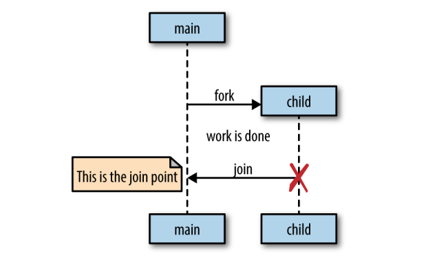

# Go's Concurrency Building Blocks #

### Goroutines ###

A goroutine is a function that is running concurrently. Every program has at least one: `the main goroutine`.

Start it with the `go` keyword. Normal functions, anonymous ones and variable assigned functions can be started this way.

Goroutines are *not* 
- OS threads 
- green threads (managed by langugage's runtime)

- Goroutines are similar to coroutines. That is, concurrent subroutines(functions, closures, methods in Go) that are *nonpreemptive* - they cannot be interrupted. 

Coroutines have multiple points throughout which allow for suspension or reentry. Goroutines don't define their own suspension or reentry points! Go's runtime observes the runtime and automatically manages them. Thus, they are preemptable only when blocked.

---

*M:N scheduler* is the mechanism for Go's goroutines. M green threads to N OS threads. It follows the *fork-join* model of concurrency.



---

```
sayHello := func() {
    fmt.Println("hello")
}
go sayHello()
// continue doing other things
```

Here, it's undetermined if the function will run at all. It *will be created and scheduled* but it may not get a chance to run. A `time.sleep` will just introduce a race condition. A `sync.WaitGroup` will solve this. This makes the output *deterministic*.

---

This piece of code will output `good day` 3x times.
It's because loop finishes before the goroutines starts. The `salutation` variable, therefore, falls out of scope and is transfered to the heap where the goroutines can still access it. Usually, the 3x `good day` will be the output.

```
var wg sync.WaitGroup
for _, salutation := range []string{"hello", "greetings", "good day"} {
    wg.Add(1)
    go func() {
        defer wg.Done()
        fmt.Println(salutation)
    }()
}
wg.Wait()
```
In order to fix this, we can do this and ensure a copy of the string is being passed:

```
var wg sync.WaitGroup
for _, salutation := range []string{"hello", "greetings", "good day"} {
    wg.Add(1)
    go func(salutation string) {
        defer wg.Done()
        fmt.Println(salutation)
    }(salutation)
}
wg.Wait()
```
Therefore, the output will contain all the strings in random order.

---

Another thing to keep in ming - context switches are *waay* faster between goroutines than between OS threads. 92% faster when talking about the benchamerks in this book. Linux build-in benchamrking suite giving 1.467 us/ context switch and Golang giving 0.225 us/ context switch.

## The sync Package ##

The package contains concurrency primitives useful for low-level memory access synchronization.

### WaitGroup ###

`WaitGroup` is useful when you want to wait for a set of concurrent operations to complete *and*
- you don't care about the result of the concurrent operation
- you have other means of collecting the results

Otherwise, just use channels and a `select` statement instead.

### Mutex and RWMutex ###

*Mutex* stands for "mutual exclusion" and is a way to guard critical sections of your program (exclusive access to a shared resource).

*RWMutex* also guards memory but here, you can request a lock for reading, in which case you'll have access *unless* the lock is being held for writing.

### Cond ###

".. a rendezvous point for goroutines waiting for or announcing the occurrence of an event."

It is useful when you want to wait on a "signal" before continuing execution on a goroutine.

```
c := sync.NewCond(&sync.Mutex{})
c.L.Lock()
for conditionTrue() == false {
    c.Wait()
}
c.L.Unlock()
```
Note - `Wait` doesn't just block, it *suspends* the current goroutine.

Cond also has the methods:
- `Signal` (FIFO list of goroutines waiting to be signaled)
- `Broadcast` (Signals *all* goroutines that are waiting) 

Which notify goroutines blocked on a `Wait` call that the condition has been triggered.

### Once ###

```
var count int

increment := func() {
    count++
}

var once sync.Once

var increments sync.WaitGroup
increments.Add(100)
for i := 0; i < 100; i++ {
    go func() {
        defer increments.Done()
        once.Do(increment)
    }()
}

increments.Wait()
fmt.Printf("Count is %d\n", count)
```

The code will print `Count is 1`. `sync.Once` is a type that ensures only *one* call is ever made to `Do` - even on different goroutines.

