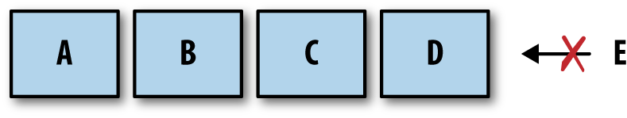

# Go's Concurrency Building Blocks #

### Goroutines ###

A goroutine is a function that is running concurrently. Every program has at least one: `the main goroutine`.

Start it with the `go` keyword. Normal functions, anonymous ones and variable assigned functions can be started this way.

Goroutines are *not* 
- OS threads 
- green threads (managed by langugage's runtime)

- Goroutines are similar to coroutines. That is, concurrent subroutines(functions, closures, methods in Go) that are *nonpreemptive* - they cannot be interrupted. 

Coroutines have multiple points throughout which allow for suspension or reentry. Goroutines don't define their own suspension or reentry points! Go's runtime observes the runtime and automatically manages them. Thus, they are preemptable only when blocked.

---

*M:N scheduler* is the mechanism for Go's goroutines. M green threads to N OS threads. It follows the *fork-join* model of concurrency.


---

```
sayHello := func() {
    fmt.Println("hello")
}
go sayHello()
// continue doing other things
```

Here, it's undetermined if the function will run at all. It *will be created and scheduled* but it may not get a chance to run. A `time.sleep` will just introduce a race condition. A `sync.WaitGroup` will solve this. This makes the output *deterministic*.

---

This piece of code will output `good day` 3x times.
It's because loop finishes before the goroutines starts. The `salutation` variable, therefore, falls out of scope and is transfered to the heap where the goroutines can still access it. Usually, the 3x `good day` will be the output.

```
var wg sync.WaitGroup
for _, salutation := range []string{"hello", "greetings", "good day"} {
    wg.Add(1)
    go func() {
        defer wg.Done()
        fmt.Println(salutation)
    }()
}
wg.Wait()
```
In order to fix this, we can do this and ensure a copy of the string is being passed:

```
var wg sync.WaitGroup
for _, salutation := range []string{"hello", "greetings", "good day"} {
    wg.Add(1)
    go func(salutation string) {
        defer wg.Done()
        fmt.Println(salutation)
    }(salutation)
}
wg.Wait()
```
Therefore, the output will contain all the strings in random order.

---

Another thing to keep in ming - context switches are *waay* faster between goroutines than between OS threads. 92% faster when talking about the benchamerks in this book. Linux build-in benchamrking suite giving 1.467 us/ context switch and Golang giving 0.225 us/ context switch.

## The sync Package ##

The package contains concurrency primitives useful for low-level memory access synchronization.

### WaitGroup ###

`WaitGroup` is useful when you want to wait for a set of concurrent operations to complete *and*
- you don't care about the result of the concurrent operation
- you have other means of collecting the results

Otherwise, just use channels and a `select` statement instead.

### Mutex and RWMutex ###

*Mutex* stands for "mutual exclusion" and is a way to guard critical sections of your program (exclusive access to a shared resource).

*RWMutex* also guards memory but here, you can request a lock for reading, in which case you'll have access *unless* the lock is being held for writing.

### Cond ###

".. a rendezvous point for goroutines waiting for or announcing the occurrence of an event."

It is useful when you want to wait on a "signal" before continuing execution on a goroutine.

```
c := sync.NewCond(&sync.Mutex{})
c.L.Lock()
for conditionTrue() == false {
    c.Wait()
}
c.L.Unlock()
```
Note - `Wait` doesn't just block, it *suspends* the current goroutine.

Cond also has the methods:
- `Signal` (FIFO list of goroutines waiting to be signaled)
- `Broadcast` (Signals *all* goroutines that are waiting) 

Which notify goroutines blocked on a `Wait` call that the condition has been triggered.

### Once ###

```
var count int

increment := func() {
    count++
}

var once sync.Once

var increments sync.WaitGroup
increments.Add(100)
for i := 0; i < 100; i++ {
    go func() {
        defer increments.Done()
        once.Do(increment)
    }()
}

increments.Wait()
fmt.Printf("Count is %d\n", count)
```

The code will print `Count is 1`. `sync.Once` is a type that ensures only *one* call is ever made to `Do` - even on different goroutines.

One important thing is that `sync.Once` counts the number `Do` is called, not how many times unique functions are passed into it. For example, this will output `1`:

```
var count int
increment := func() { count++ }
decrement := func() { count-- }

var once sync.Once
once.Do(increment)
once.Do(decrement)

fmt.Printf("Count: %d\n", count)
```

### Pool ###

`Pool` is a concurrent-safe implementantion of the object pool pattern. This pattern is usually used to constrain the creation of things that are expensive (e.g. database connections), while an indeterminate number of operations can still request access to these things.

```
myPool := &sync.Pool{
    New: func() interface{} {
        fmt.Println("Creating new instance.")
        return struct{}{}
    },
}
myPool.Get()
instance := myPool.Get()
myPool.Put(instance)
myPool.Get()
```

This will print out `Creating new instance` twice. In the last step, the `New` function will not be invoked since we are reusing a previously allocated instance.

You can also use `Pool` to warm a cache of pre-allocated objects for operations that need to run really fast. For example, writing a high-throughput network server that responds as quickly as possible to requests.

### Channels ###

Channels are one of the synchronization primitives in Go derived from Hoare's CSP. They are best used to communicate information between goroutines (can also be used to synchronize memory access).

You can think of a channel as a *stream* of information. They can be bideractional of unideractional when speaking about their data flow.

```
// A channel that can only read
var dataStream <-chan interface{}
dataStream := make(<-chan interface{})
```

```
// A channel that can only send
var dataStream chan<- interface{}
dataStream := make(chan<- interface{})
```

Unidirectional channels are mostly used as function parameters and return types. This is because Go implicitly convers bidirectional channels to unidirectional ones, when needed.

Channels in Go are *blocking*. If you attempt to read from an empty channel it will wait and if you attempt to write to a full channel it will also wait.

`salutation, ok := <-stringStream` the boolean indicates if the 
- value was generated by a write elsewhere in the process
- default value generated by a closed channel

We can use 'close' to..well..close a channel. We can still read from a closed stream, though. This is to allow support for multiple downstream reads from a single upstream writer on the channel. For example:

```
intStream := make(chan int)
close(intStream)
integer, ok := <- intStream
fmt.Printf("(%v): %v", ok, integer)
```

This will output: `(false): 0`. The boolean value is false since it's the zero value for `int`, not a value placed on the stream.

We can also range over a channel, breaking the loop when the channel is closed:

```
// Output being: 1,2,3,4,5
intStream := make(chan int)
go func() {
defer close(intStream)
for i := 1; i <= 5; i++ {
        intStream <- i
    }
}()

for integer := range intStream {
    fmt.Printf("%v ", integer)
}
```

We also have *buffered channels* which are channels that are given a *capacity* when they are initiated. You can perform n writes where n is the size of the buffer.

```
var dataStream chan interface{}
dataStream = make(chan interface{}, 4)
```

If we were to make a buffered channel with a capacity of 4:

```
c := make(chan rune, 4)

// And then write to it..
c <- 'A'
c <- 'B'
c <- 'C'
c <- 'D'
// Oops..
c <- 'E'
// If we were to do `<-c` afterwards, then the channel 
// would become unblocked and the `E` rune would be 
// placed at the end of it. A <- B C D E
```



---

In order to reason about our programs logically, *ownership* becomes an essential concept. Channel owners have write-acess properties (`chan` or `chan<-`) and channel utilizers have read-only properties (`<-chan`).

A goroutine that owns a channel means that it can
- instantiate the channel
- write/ pass ownership to another goroutine
- close the channel
- encapsulate the previous three things and expose them via a reader channel

Then, we mitigate the instances when our operations can cause the program to panic. This lets us, as a consumer of a channel, to worry about:
- knowing when a channel is closed
- responsibly handling blocking for any reason

We can see this principles at play here:

```
chanOwner := func() <-chan int {
    resultStream := make(chan int, 5)
    go func() {
        defer close(resultStream)
        for i := 0; i <= 5; i++ {
        resultStream <- i
        }
    }()
    return resultStream
}

resultStream := chanOwner()
for result := range resultStream {
    fmt.Printf("Received: %d\n", result)
}
fmt.Println("Done receiving!")
```